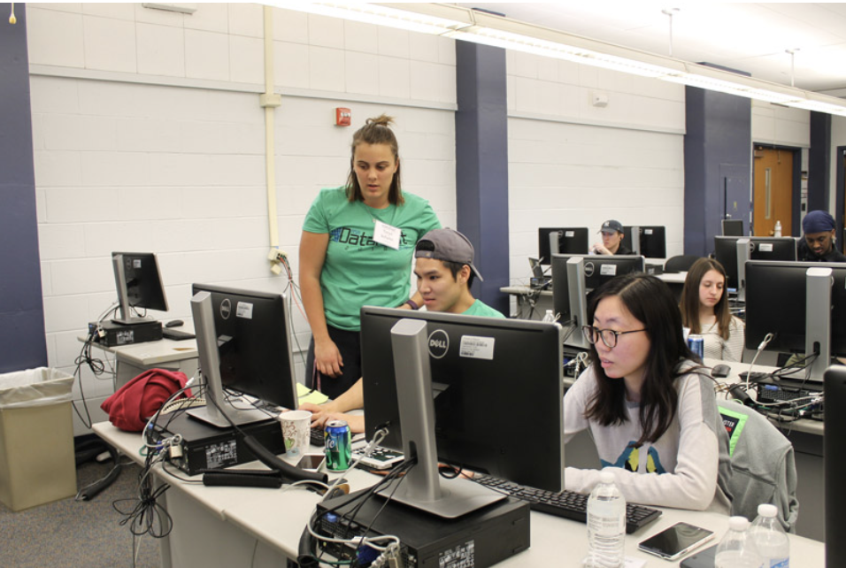

### Lead Workshop Organizer, KDD 2021

**Data-Driven Exploration of Interconnected Risks in Complex Human–Natural Systems**

*Risk identification & quantification in complex human-natural systems via convergent data intensive research.*

[Learn more here](https://sites.google.com/view/prism-prj/kdd-2021-workshop)

### Workshop Presenter, Code-RLadies Mid-MO

2020-2021

- [Kable for Tables](https://www.meetup.com/rladies-mid-mo/events/274537983/)
- [Parallel Computing and dplyr](https://www.meetup.com/rladies-mid-mo/events/269931968/)

[About Code-RLadies](https://code-rladies.github.io)

:::: {style="display: flex;"}

::: {}

### Workshop Presenter, ASA Datafest Mid-MO

*University of Missouri, Statistics Dept., Columbia, MO*  

2017-2020

Working with Data

- Dplyr and Tidyr packages
- Merging multiple data sources
- Cleaning data
- Creating new variables
- Long vs. wide data

[Learn more here](https://datafest.stat.missouri.edu/about.html)

:::

::: {}

```{r datafest, echo = FALSE, fig.align='left', fig.cap="Working with students Datafest 2018"}

```

:::

::::

### Graduate Instructor

*University of Missouri, Statistics Dept., Columbia, MO* 

2015-2017

-   Introductory Statistical Reasoning (STAT 1200)

-   Introduction to Probability and Statistics I (STAT 2500)

-   Introduction to Probability and Statistics II (STAT 3500)

### Teaching Assistant

*Colorado State University, Biology Dept., Fort Collins, CO.*

2011

-   Biology of Organisms Lab (LIFE 103)
