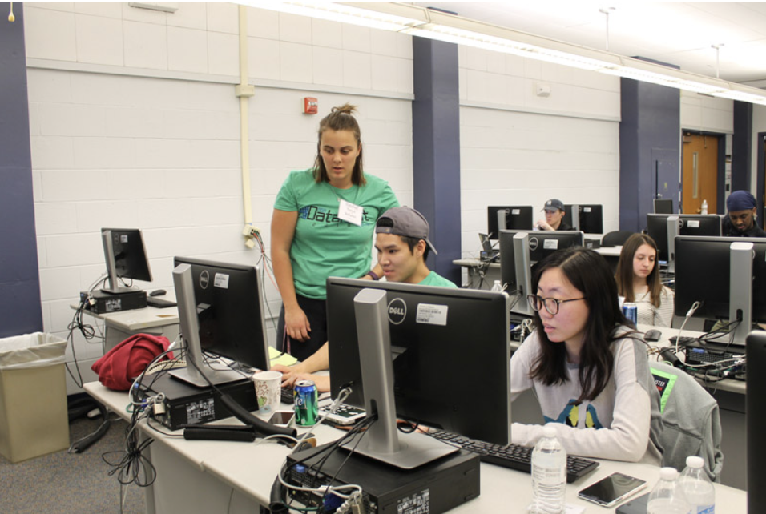

## Texas A&M University

*Statistics Dept., College Station, TX*

- Reproducible Computations (STAT 600): Fall 2024, Fall 2025, Fall 2026
- Database & Computing Tools for Data Science (STAT 624): Spring 2024, Spring 2025, Spring 2026
- Statistical Computing (STAT 404): Spring 2023, Fall 2023, Fall 2024
- Frontiers: Reinforcement Learning (STAT 691): Fall 2023
- Statistical Methods (STAT 303): Fall 2022, Fall 2026

## Instructor, High School STAT Camp

2023, 2025, 2026

## Lead Workshop Organizer, Knowledge Discovery and Data Mining (KDD) 2021

**Data-Driven Exploration of Interconnected Risks in Complex Human–Natural Systems**

*Risk identification & quantification in complex human-natural systems via convergent data intensive research.*

Conference Proceedings DOI: [10.1145/3447548.3469480](https://doi.org/10.1145/3447548.3469480)

[Learn more here](https://sites.google.com/view/prism-prj/kdd-2021-workshop)

## Workshop Presenter, Code-RLadies Mid-MO

2020–2021

- [Kable for Tables](https://www.meetup.com/rladies-mid-mo/events/274537983/)
- [Parallel Computing and dplyr](https://www.meetup.com/rladies-mid-mo/events/269931968/)

[About Code-RLadies](https://code-rladies.github.io)

## Workshop Presenter, ASA Datafest Mid-MO

*University of Missouri, Statistics Dept., Columbia, MO*

2017–2020

Working with Data

- Dplyr and Tidyr packages
- Merging multiple data sources
- Cleaning data
- Creating new variables
- Long vs. wide data

[Learn more here](https://datafest.stat.missouri.edu/about.html)

{width=80%}

## Graduate Instructor

*University of Missouri, Statistics Dept., Columbia, MO*

2015–2017

- Introductory Statistical Reasoning (STAT 1200)
- Introduction to Probability and Statistics I (STAT 2500)
- Introduction to Probability and Statistics II (STAT 3500)

## Teaching Assistant

*Colorado State University, Biology Dept., Fort Collins, CO*

2011

- Biology of Organisms Lab (LIFE 103)
